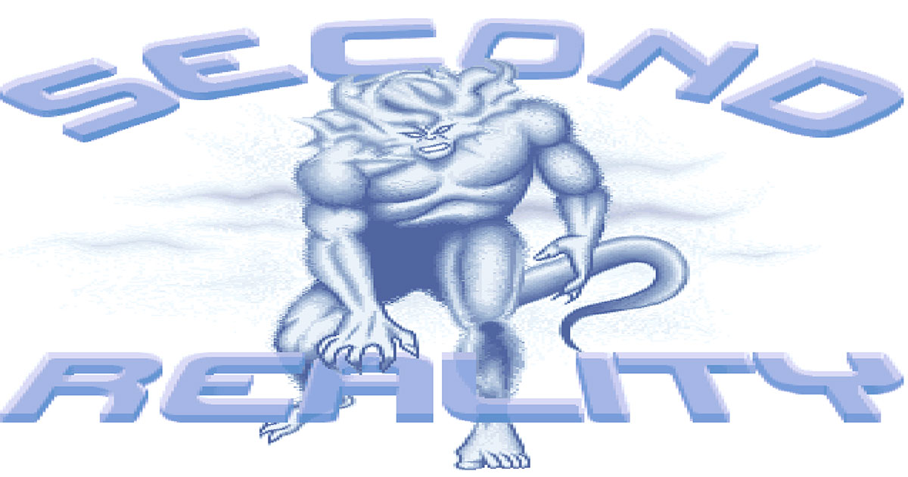
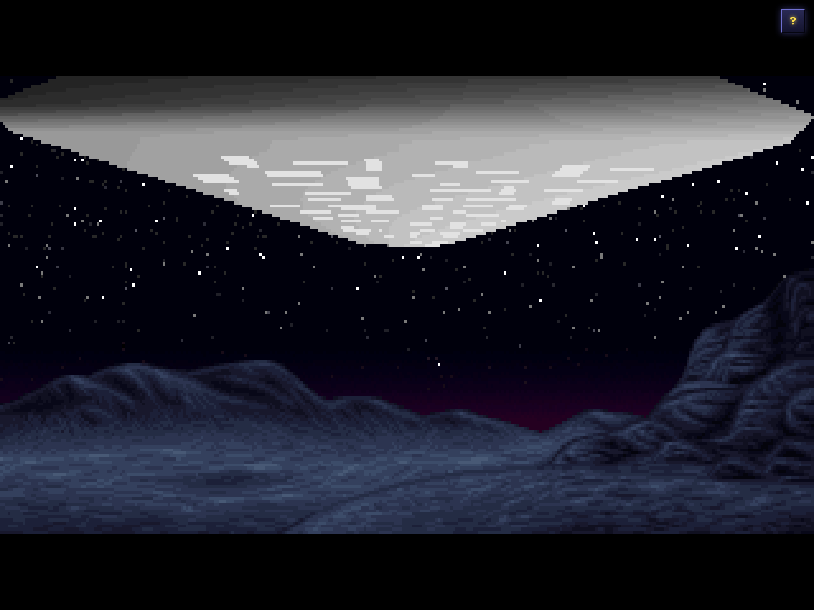
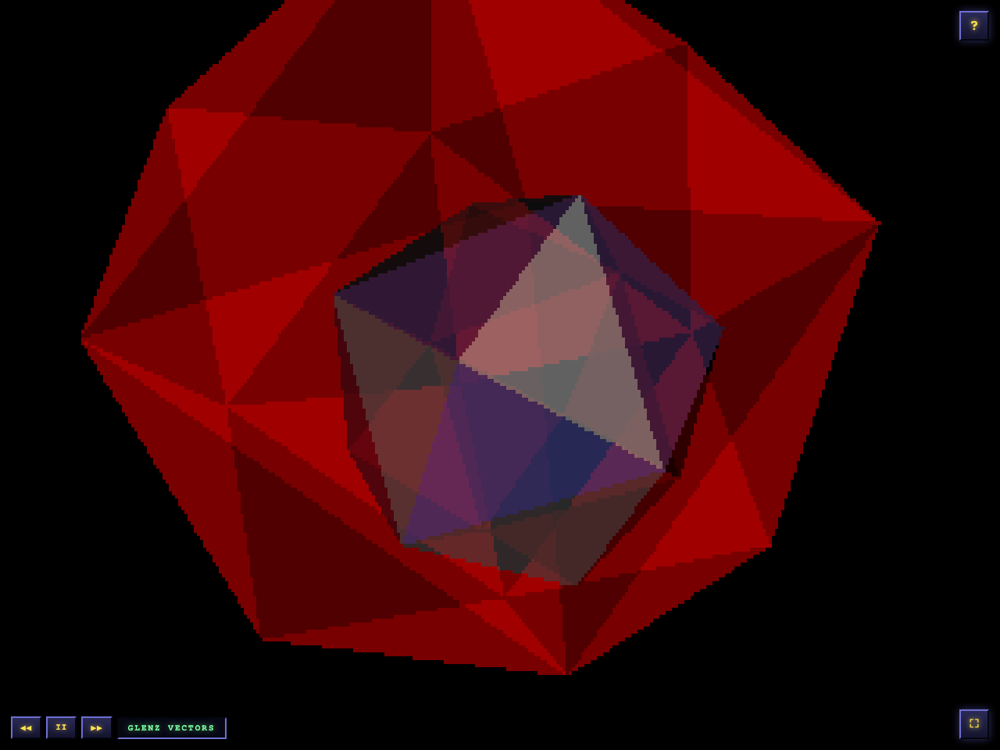
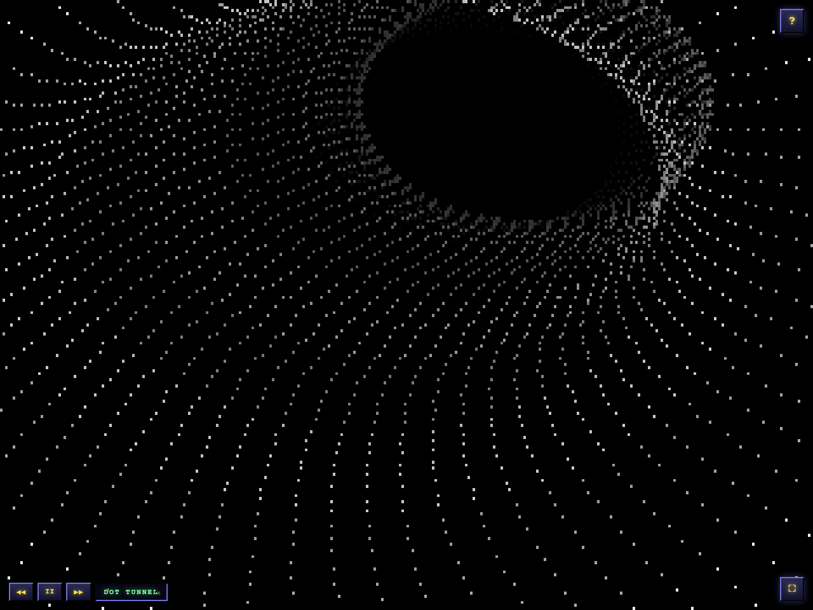

# Second Reality, playable in a browser

[](https://www.secondreality1993.com/)

**[www.secondreality1993.com](https://www.secondreality1993.com/)** — Future Crew's *Second Reality*, the Assembly ’93 PC demo, rebuilt from the original 1993 sources. Not a video, not an emulator.

In 1993 a group of Finnish teenagers wrote a program that made a 486 do things the PC was not supposed to be able to do. Second Reality won the demo competition at Assembly ’93 on 30 July 1993 and is still routinely named the best PC demo made. For its twentieth anniversary Future Crew released the complete source and data into the public domain.

This repository holds that release, byte for byte as they published it, and a re-implementation of the demo that runs in a browser — built from the C, the x86 assembly, the Turbo Pascal, the linked object files and the shipped executables. Around it is a site in the shape of a BBS, because that is how you got Second Reality in 1993: you dialled somebody’s house in Espoo and waited twenty-five minutes.

| | | |
|---|---|---|
|  |  |  |

## The board

Press the key, or click. `/` opens a command line with TAB completion, ESC goes up one level, `?` is help.

| Key | Screen | |
|:--:|---|---|
| **1** | [Run the demo](https://www.secondreality1993.com/?play) | fullscreen, volume up |
| **J** | [Jump to a part](https://www.secondreality1993.com/parts.html) | every part, and who wrote it |
| **2** | [Play the music](https://www.secondreality1993.com/tracker.html) | the demo’s own modules, playing in a Scream Tracker 3 |
| **3** | [What this is](https://www.secondreality1993.com/about.html) | the port, in brief |
| **4** | [Future Crew](https://www.secondreality1993.com/crew.html) | who they were, where they went |
| **5** | [Why it mattered](https://www.secondreality1993.com/legacy.html) | Assembly ’93 and after |
| **6** | [Scream Tracker](https://www.secondreality1993.com/scream.html) | the tracker and the S3M format |
| **7** | [How the port works](https://www.secondreality1993.com/tech.html) | technical |
| **8** | [Gallery](https://www.secondreality1993.com/gallery.html) | artwork from the release |
| **9** | [Credits](https://www.secondreality1993.com/credits.html) | who made this |
| **L** | [Licence](https://www.secondreality1993.com/license.html) | public domain |

Seven more screens are on no menu: [`/u`](https://www.secondreality1993.com/hidden-part.html) the part the loader never runs, [`/386`](https://www.secondreality1993.com/hw.html) what it wanted from your PC, [`/surround`](https://www.secondreality1993.com/dolby.html) in Dolby Surround, [`/mail`](https://www.secondreality1993.com/starport.html) StarPort, [`/pxl`](https://www.secondreality1993.com/pixel.html) PXL SUX, [`/stats`](https://www.secondreality1993.com/sysop.html) system information, [`/logoff`](https://www.secondreality1993.com/bye.html). A unique abbreviation is enough — `/lic` will do.

Any part is a link you can send: [`/?part=techno`](https://www.secondreality1993.com/?part=techno).

## Not an emulator

There is no DOS here and no x86 interpreter. The original is nineteen separate DOS executables chain-loaded by a custom loader (`MAIN/U2.ASM`) that unpacks each part out of one archive and keeps the music playing across the transitions. The port mirrors that: one host module owning the clock, the display and the phase machine, and one JavaScript module per part, each ported from that part’s own source directory. Parts hand each other the screen — several transitions are pixel-identical across the boundary by design, and the port reproduces that rather than fading between them.

**VGA is reproduced, not emulated.** Second Reality barely uses a normal video mode: tweaked planar modes built from undocumented CRTC registers, scrolling by moving the hardware’s read pointer, a line-compare split screen, and palette animation for most of the fades and flashes. So the port keeps an 8-bit indexed framebuffer and does the palette lookup in a shader, exactly as the DAC did — one triangle, two textures, a four-line fragment shader, about forty lines of WebGL2 and no graphics library. The GPU never sees a polygon: the ship, the glenz solid and the dot tunnel are the original’s own software rasterisers, ported line for line. → [tech-vga](https://www.secondreality1993.com/tech-vga.html)

**Timing comes from the music.** Parts do not wait for a number of frames; they ask the resident interrupt server where the song is — `dis_sync()`, `dis_musrow()`, `dis_musplus()`, `dis_getmframe()` — and the `+++` markers in the order list are beacons a part can count rows towards. The port models each of these against the real S3M, and where the audio engine can report a live position it uses that in preference to any simulation. → [tech-timing](https://www.secondreality1993.com/tech-timing.html)

**The music is copy-protected.** The `.s3m` files in the release are XOR-scrambled and load in a tracker as garbage; `STARTMUS.C` unscrambled them in memory at start-up, and patched the tempo byte from 125 to 120 while it was there. The port ships the release’s own bytes, still scrambled, and runs the same routine in the browser before they reach libopenmpt:

```
n      = (i >> 1) + 1
key(i) = ((n ^ (n >> 2)) << 3) | ((5i + 2) & 7)
```

The keystream was reconstructed from the scrambled files alone, by constraint-solving the S3M format (`glenz-web/tools/recover_keystream.py`). → [tech-music](https://www.secondreality1993.com/tech-music.html)

**The art was inside the executables.** Most of it was never saved as image files: it is linked into the `.EXE`s as data segments, so recovering it means reading OMF `LEDATA` records — and for two parts, unpacking PKLITE (with LZEXE underneath) and disassembling. That is how we know `3DSINFLD.EXE` is really the program in `COMAN/`, renamed at build time, and how seven credits paintings that are placeholders in the development objects were recovered from the shipped `CRED.EXE`. The port loads 83 files, 3.91 MB, and not one of them is an image: raw bitmaps, the original’s precomputed tables, packed pictures still packed, the S3Ms still scrambled — every one regenerated from the release by a tool in `unreal2/tools/` and decoded at runtime with the original’s own routines. → [tech-assets](https://www.secondreality1993.com/tech-assets.html)

**It is checked against a second reading of the source.** Nine deterministic validators import the real part modules — which touch no DOM — and compare them with an independent transcription of the original C or assembly written inside the validator. Two readings of the same 1993 source have to agree byte for byte, or one of them is wrong. A tenth check plays real audio and measures the visual clock against the engine’s reported position; it is the only one that can see A/V drift. → [tech-verify](https://www.secondreality1993.com/tech-verify.html)

**The hidden part is included.** The loader lists `DDSTARS.EXE` under a `;txthid 'Hidden part'` comment, reachable only through an undocumented command-line `U`. `SECOND U` runs it and nothing else, on MUSIC0 from order 70 — eight patterns fenced off by end-markers that no other part starts at. It is a message from the crew about why the demo shipped ten weeks after it won. Here it is [`/?part=hidden`](https://www.secondreality1993.com/?part=hidden). → [the part that never runs](https://www.secondreality1993.com/hidden-part.html)

## Every part

The loader’s own chain, from `MAIN/U2.ASM`, which carries the crew’s working title beside each executable it loads. Two rows share one executable where the loader’s comment does. Each link starts the demo there.

| # | Part | Executable | Source | By | Working title (1993) |
|--:|---|---|---|---|---|
| 01 | [Title cards](https://www.secondreality1993.com/?part=cards) | ALKU.EXE | `ALKU/` | Wildfire | Alkutekstit I |
| 02 | [Panorama + credits](https://www.secondreality1993.com/?part=panorama) | ALKU.EXE | `ALKU/` | Wildfire | Alkutekstit I |
| 03 | [Ship flyby](https://www.secondreality1993.com/?part=ship) | U2A.EXE | `VISU/` | Psi | Alkutekstit II |
| 04 | [Moon explosion](https://www.secondreality1993.com/?part=moon) | PAM.EXE | `PAM/` | Trug, Wildfire | Alkutekstit III |
| 05 | [Second Reality](https://www.secondreality1993.com/?part=logo) | BEGLOGO.EXE | `BEG/` | Trug, Wildfire | Alkutekstit III |
| 06 | [Glenz vectors](https://www.secondreality1993.com/?part=glenz) | GLENZ.EXE | `GLENZ/` | Psi | Glenz |
| 07 | [Dot tunnel](https://www.secondreality1993.com/?part=tunnel) | TUNNELI.EXE | `TUNNELI/` | Trug | Dottitunneli |
| 08 | [Techno](https://www.secondreality1993.com/?part=techno) | TECHNO.EXE | `TECHNO/` | Psi | Techno |
| 09 | [Panicend](https://www.secondreality1993.com/?part=panic) | PANICEND.EXE | `PANIC/` | Wildfire | Panicfake |
| 10 | [Mountain scroll](https://www.secondreality1993.com/?part=mntscrl) | MNTSCRL.EXE | `FOREST/` | Trug | Vuori-Scrolli |
| 11 | [Lens + rotazoom](https://www.secondreality1993.com/?part=lens) | LNS&ZOOM.EXE | `LENS/` | Psi | Lens · Rotazoomer |
| 12 | [Plasma + cube](https://www.secondreality1993.com/?part=plasma) | PLZPART.EXE | `PLZPART/` | Wildfire | Plasma · Plasmacube |
| 13 | [Mini vectorballs](https://www.secondreality1993.com/?part=minvball) | MINVBALL.EXE | `DOTS/` | Psi | MiniVectorBalls |
| 14 | [Water raytracer](https://www.secondreality1993.com/?part=rayscrl) | RAYSCRL.EXE | `WATER/` | Trug | Peilipalloscroll |
| 15 | [3D sinefield](https://www.secondreality1993.com/?part=sinfield) | 3DSINFLD.EXE | `COMAN/` | Psi | 3D-Sinusfield |
| 16 | [Jelly logo](https://www.secondreality1993.com/?part=jellypic) | JPLOGO.EXE | `JPLOGO/` | Psi | Jellypic |
| 17 | [Vector part II](https://www.secondreality1993.com/?part=u2e) | U2E.EXE | `VISU/` | Psi | Vector Part II |
| 18 | [End picture](https://www.secondreality1993.com/?part=endlogo) | ENDLOGO.EXE | `END/` | ? | Endpictureflash |
| 19 | [Credits](https://www.secondreality1993.com/?part=credits) | CRED.EXE | `CREDITS/` | ? | Credits/Greetings |
| 20 | [End scroller](https://www.secondreality1993.com/?part=endscrl) | ENDSCRL.EXE | `ENDSCRL/` | ? | Credits/Greetings |
| ·· | [Hidden part](https://www.secondreality1993.com/?part=hidden) | DDSTARS.EXE | `DDSTARS/` | Psi | Desert Dream Stars |

## Running it locally

```bash
python3 unreal2/tools/serve.py 8094      # a no-cache dev server, from the repository root
```

<http://localhost:8094/> is the board and <http://localhost:8094/unreal2/> is the player on its own. A web server is required: the music plays through an AudioWorklet, which browsers refuse on `file://`.

The player takes `?part=<slug>` (the slugs are in the links above, plus `hidden`), `?jump=<seconds>`, and `?silent` — no audio, no click gate, the timeline on a performance clock, which is what the screenshot harness uses.

### Validators

```bash
cd unreal2
for f in tools/validate_*.mjs tools/verify_u2e.mjs; do node "$f" || break; done
node tools/av_skew.mjs        # the one that plays real audio; needs the dev server up
```

The nine deterministic validators need nothing but Node: they point `fetch()` at the filesystem and import the same modules the browser runs. There is no test build.

### Regenerating the assets and the art

Every file in `unreal2/assets/` comes out of the release by way of a tool in `unreal2/tools/` — `extract_*.mjs` and `convert_u2e.mjs` rebuild them — and `make_site_art.mjs` renders the gallery in `img/art/` from those decoded assets. Nothing in the repository is a binary of unknown origin.

## Repository layout

```
unreal2/            the port — main.js is the host, one module per part, s3msim.js the descrambler and timeline simulator
  assets/           83 files, 3.91 MB, every one regenerated from the release by a tool in tools/
  tools/            extractors, validators, the screenshot harness, the dev server
  vendor/           libopenmpt and chiptune3 — the only third-party code the demo runs
glenz-web/          the first port: the glenz-vectors part on its own, and the keystream-recovery tool
*.html  bbs.*       the board, served from the repository root; tracker.js is the Scream Tracker
img/                the site's images; img/art/ is rendered from the release's own data
docs/               Future Crew's own README from the 2013 release
everything else     the 1993 release, untouched — the C, assembly and Pascal, the objects, the executables, the data
```

## Credits

**The demo, 1993.** Second Reality is Future Crew’s. Code by Psi, Trug and Wildfire; music by Purple Motion and Skaven; graphics by Pixel and Marvel. They released all of it into the public domain in 2013, which is the only reason this port can exist.

**This port, 2026.** Put together by Chris Stanchak — [@chrisstanchak](https://x.com/chrisstanchak) on X, [stanchak](https://github.com/stanchak) on GitHub. Written by Claude Opus 5 and Claude Fable 5 (Anthropic); dirty work by Grok 4.6 (xAI). The port was built by directing large language models against the original source: reading the 1993 C, assembly and Pascal, deriving each part’s timing from the code that produced it, and verifying the result against a test suite rather than against screenshots. The human role was direction, judgement and calling out what looked wrong — which is most of what made it come out right. The models are credited because they did the work.

## Licence

Public domain, top to bottom — see [LICENSE](LICENSE). Future Crew released the original source and data under the [Unlicense](https://unlicense.org/) in 2013 ([their statement](docs/README-futurecrew.md)), and the port, the tools and the site are released under the same terms: take them, fork them, ship them, sell them — no attribution required, no conditions.

Third-party components keep their own permissive licences: libopenmpt (BSD-2-Clause), chiptune2/3.js (MIT) and, in `glenz-web/` only, three.js (MIT). Photographs of people on the site are credited beside each picture and remain their owners’.

**Sources.** The 1993 release itself — source, data and executables. Wikipedia on Future Crew, Second Reality, Scream Tracker and S3M. Fabien Sanglard, [*Second Reality code review*](https://fabiensanglard.net/second_reality/). Hackaday, *Under the Hood of Second Reality*. [pouet.net/prod.php?which=63](https://www.pouet.net/prod.php?which=63).
